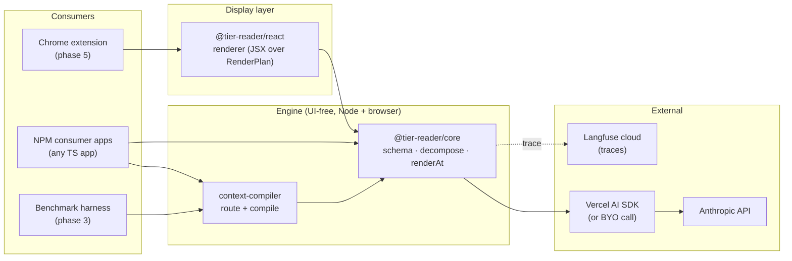

# Architecture

Live map of how the system is wired. Updated by `/finish-phase` as components land. See `specs/mission.md` and `specs/tech-stack.md` for *why*; this doc is *what and where*.

## 0. High-level flow



Detailed topology (extension internals, dependency direction) follows in §1–§3.

## 1. System topology

```
+--------------------------+        +-------------------+        +--------------------+
| User's Chrome (phase 5+) |        | NPM consumers     |        | Anthropic API      |
|  - Extension popup       |        | (any Node + TS    |        | (api.anthropic.com)|
|  - Content script        |  --→   |  app importing    |  --→   +--------------------+
|  - chrome.storage.local  |        |  @tier-reader/* / |                  ↑
|    (API key, settings)   |        |  context-compiler)|                  | via Vercel AI SDK
+--------------------------+        +-------------------+                  | or BYO call()
              │ uses                          │ uses                       │
              ▼                               ▼                            │
       @tier-reader/react   ───→    @tier-reader/core   ─────────────────  ┘
                                          ▲
                                          │ uses
                                   context-compiler
                                          │ traces to
                                          ▼
                                   Langfuse cloud
```

## 2. Runtime workflow — one decomposition

```
input text
   │
   ▼
detectTier(input, model)
   │
   ├──── small ────► decompose() one-shot ──┐
   │                                         │
   ├──── medium ───► pass 1: top-level       │
   │                 outline (titles only)   │
   │                          │              │
   │                 pass 2: per-section     │
   │                 decompose in parallel ──┤
   │                                         │
   └──── large ────► chunkByStructure()      │
                              │              │
                     decompose each chunk    │
                              │              │
                     synthesize: merge ──────┤
                     chunk roots             │
                                             ▼
                                        Tree (in-memory)
                                             │
                       ┌─────────────────────┼─────────────────────┐
                       ▼                     ▼                     ▼
                  renderAt(tree,       route(tree, agent)    serialize / cache
                  id, depth)                  │                     │
                       │                      ▼                     ▼
                       ▼               compile(nodes,         (future: persist
                  RenderPlan           budget, format)          decompositions)
                       │                      │
                       ▼                      ▼
                  React renderer        per-agent context slice
```

## 3. Repo layout

```
tier-reader/
├─ packages/
│  ├─ core/                        ← @tier-reader/core
│  │  ├─ src/
│  │  │  ├─ schema.ts              types per docs/schema.md
│  │  │  ├─ decompose.ts           tier dispatch + small one-shot
│  │  │  ├─ decompose-medium.ts    outline pass + parallel sections
│  │  │  ├─ decompose-large.ts     chunk + sequential + synthesis merge
│  │  │  ├─ chunk.ts               structural chunker (headings → paragraphs)
│  │  │  ├─ tier.ts                detectTier, small/medium/large
│  │  │  ├─ render.ts              renderAt
│  │  │  ├─ provider/
│  │  │  │  ├─ ai-sdk.ts           Vercel AI SDK adapter
│  │  │  │  └─ byo.ts              { call(prompt) } escape hatch
│  │  │  └─ trace.ts               Langfuse wrapping
│  │  └─ test/
│  ├─ context-compiler/            ← context-compiler
│  │  ├─ src/
│  │  │  ├─ route.ts               route(tree, agent) → Node[]
│  │  │  ├─ compile.ts             compile(nodes, budget, format) → string
│  │  │  └─ index.ts
│  │  ├─ benchmarks/               20-message benchmark + results.json
│  │  └─ test/
│  └─ react/                       ← @tier-reader/react
│     ├─ src/
│     └─ test/
├─ apps/
│  ├─ extension/                   ← phase 5
│  │  ├─ manifest.json             (manifest v3)
│  │  ├─ src/
│  │  │  ├─ content.tsx
│  │  │  ├─ options.tsx
│  │  │  └─ background.ts
│  │  └─ test/
│  └─ playground/                  ← Vite + React app wrapping decompose() for prompt iteration (dev-only)
│     ├─ src/                      App.tsx (3-mode tree view + drill-down + tier badge), api.ts
│     └─ server/decompose-route.ts /api/decompose (tier + synthesisMerge passthrough; returns resolved tier) + /api/fixtures Vite middleware (Node-side)
├─ specs/                          ← constitution (mission, tech-stack, roadmap, per-phase folders)
├─ docs/                           ← live docs (this file, schema, api)
├─ package.json                    ← pnpm workspace root
├─ pnpm-workspace.yaml
├─ turbo.json
├─ biome.json
└─ tsconfig.base.json
```

**Dependency direction (no cycles):**

```
apps/extension              → packages/react
apps/playground             → packages/core (dev-only; Node side via /api/decompose)
packages/react              → packages/core
packages/context-compiler   → packages/core
packages/core               → (no internal deps; only Vercel AI SDK + Langfuse)
```

**`@tier-reader/core` package exports:**

- `.` (default) — full surface (`decompose`, providers, `renderAt`, schema). Contains `node:crypto` import; Node-only.
- `./render` — browser-safe subset (`renderAt` + types). No node-built-in imports; safe for bundlers targeting the browser.

## Invariants

- `core` has zero browser-only dependencies; runs in Node.
- `react` has no Anthropic / OpenAI client deps; calls into `core` only.
- The extension never embeds an API key; it reads from `chrome.storage.local`.
- All LLM calls in `core` go through the trace-wrapped provider interface (no direct fetches outside `provider/`).
- Schema version is the literal `1`; bumping requires a migration note here.
- `tier-reader.jsx` (root prototype) is *not* on any dependency path of the shipped packages — it's a pre-existing reference until phase 5 supersedes it.
- The playground's Anthropic API key never reaches the browser. `apps/playground/.env.local` is read by the Vite Node process; `/api/decompose` calls Anthropic server-side and returns only the resulting `Tree`.
- All non-small tiers ultimately produce a single `Tree` with valid structural ids — consumers see no schema-level difference between tiers. Medium and large strategies stitch sub-results before id-walking, so `"0"`, `"0.0"`, `"0.0.0"` invariants always hold.
- **Verbatim reconstruction.** Concatenating leaf `detail` in tree order ≈ source (whitespace differences tolerated). The decompose prompt enforces this: a parent title is a *summary* of what's beneath it, not a *replacement* for source text. If the parent title contains content from the source's opening sentence, that sentence must still appear in some leaf's `detail`. Phase-2.5 fixed a regression where the model was dropping each paragraph's opening sentence into the parent title and never emitting it as a leaf.
- **v1 published surface ≠ in-tree code.** Phase 3 (closed 2026-05-18) shipped the `context-compiler` package with `route()` + `compile()` + a full benchmark harness, but the routing experiment did not produce a defensible win over `flat-broadcast` / DACS-style focus baselines (three structural blockers documented in `specs/roadmap.md` → "Deferred / Under Evaluation" → *Multi-agent context routing*). The code remains in the repo as a research artifact; it is **not** on the v1 NPM-published surface. The v1 published surface is `@tier-reader/core` only (decompose + renderAt + schema). The `tags?` / `entities?` schema fields on `Node` are retained as advisory metadata for future router consumers — `core` itself does not consume them in v1, but they're cheap to keep and removing them later would be a breaking change. `compile()` may be re-homed into `core` or shipped as a slim package when publish-prep is pulled in from Deferred; that decision lives with the *NPM publish prep* Deferred item.
- **Decompose prompt-emission invariants are not gated by unit tests.** The Phase-3 group-1 tests for `tags` / `entities` (`packages/core/test/decompose-tags-entities.test.ts`) verify schema *passthrough* through a canned-provider mock — they do not invoke the prompt against a real model and assert the model honored the emission instructions. The 3.4 smoke triage surfaced the cost: the model was emitting `tags=[]` on every node and the test suite was unaware. The broader gap (real-model gating for fanout adherence, depth budget, structure-respect, verbatim reconstruction Jaccard, semantic-label emission) is tracked under `specs/roadmap.md` → "Deferred / Under Evaluation" → *Automated output-quality tests / real-model prompt gate*. Prompt edits between now and that gate landing rely on manual spotcheck.

### Seam behavior (large tier)

The large tier chunks the source on structural boundaries (markdown headings, then paragraph groups), decomposes each chunk independently, then merges. We accept the following for v1:

- **Occasional duplication across chunk boundaries.** A claim that straddles a heading may appear in two adjacent chunks. Cross-section rebalancing is deferred (see roadmap § Deferred).
- **Source order preserved.** Synthesis merge re-groups chunk roots but never reorders them; `chunkIndices` are required to be ascending. Children appear in source order.
- **Synthesis merge improves cohesion, does not eliminate seams.** With merge on, the top level reads as one outline; lower levels still reflect chunk-shaped decomposition. With merge off, top-level fanout equals the chunk count under a synthetic root.
- **No leaf is dropped.** The merge step preserves every chunk root; if the model omits any, they are appended under a fallback "Additional content" section so the source-reconstruction invariant (concat of leaf `detail` ≈ source) holds.

Phase 2.5 evaluates alternative tactics (retrieval-then-decompose, iterative refinement, semantic chunking) and decides which, if any, graduate into the engine.

## What this doc tracks going forward

`/finish-phase` updates this file when a phase changes any of:

- Routes / endpoints (extension messaging, etc.)
- Persistent state shape (`chrome.storage` keys, on-disk fixtures, NPM package boundaries)
- Runtime workflow (the diagram in §2)
- Invariants

Most phases will add to §1, §2, or §3.
